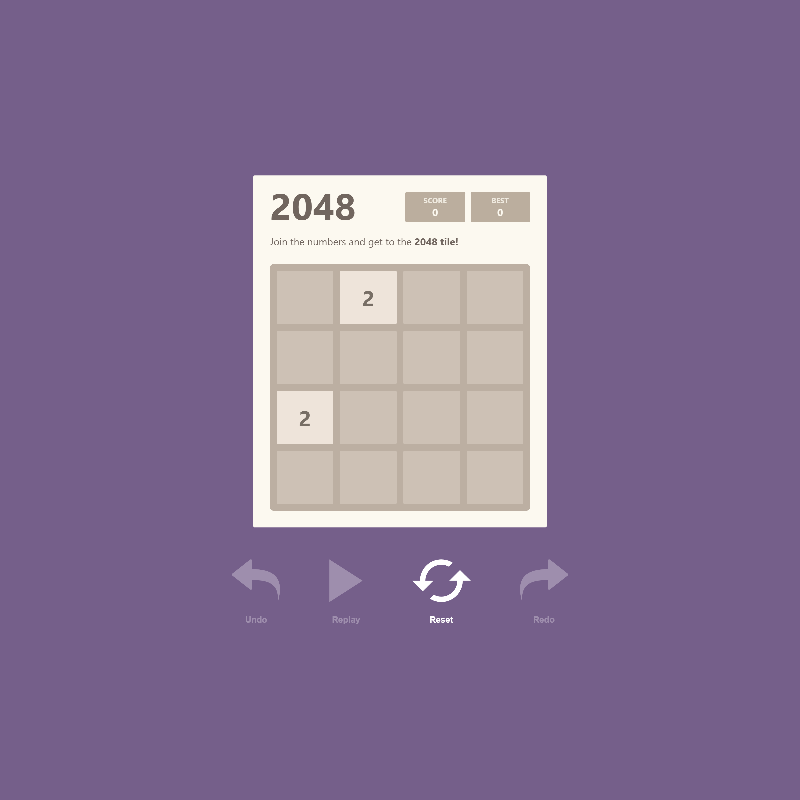

# React 2048

2048 Game Made With React

## Requirements Checklist
- [x] Solution should be a web app written in React.
- [x] Game should be playable using the arrow keys of the keyboard.
- [x] Best score and current score should be tracked.
- [x] The web-app should remember its previous state if the page is reloaded.
- [x] The UI has to be exactly as shown in the design.
- [x] Game should have an UNDO button, that undoes the last move. If there are no last moves it should be disabled.
- [x] Game should have a REDO button that redoes the movie. If there are no moves to redo, it should be disabled.
- [x] Game should have a REPLAY button that basically auto plays the game from the first move to the most recent move. When starting the game, the Replay button should be disabled.
- [x] The Replay should have a timeout of 2 seconds between each move
- [x] When Replay is in progress, no new moves are allowed.
- [x] Add a reset button to the UI, which will essentially restart the game from scratch.
- [ ] Basic rules & conventions of the 2048 game should be followed. (tile merging pending)
